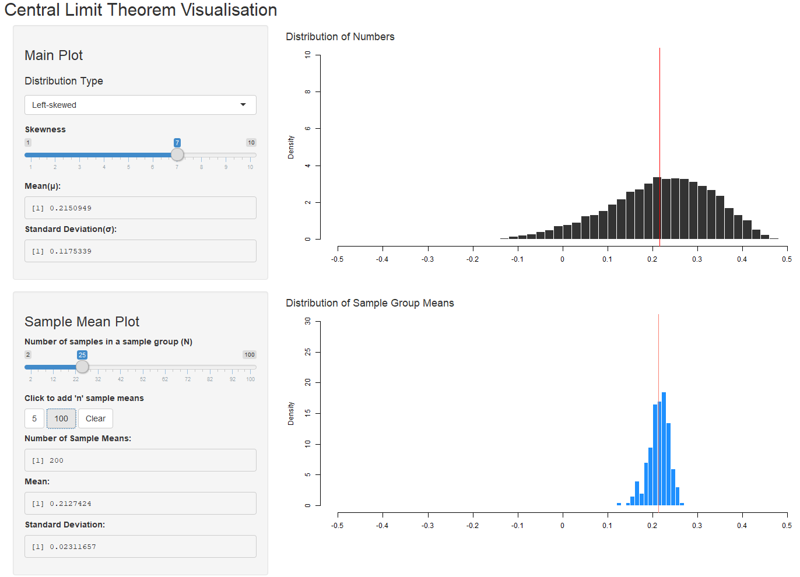
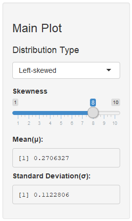
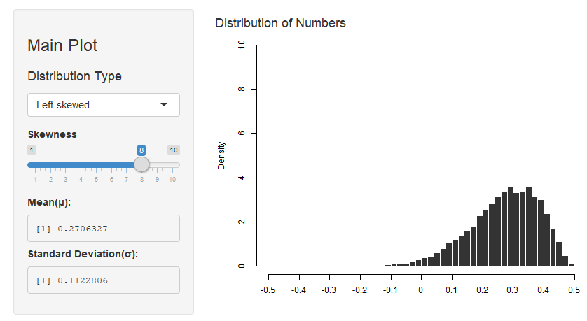
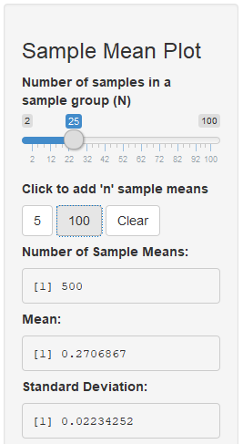
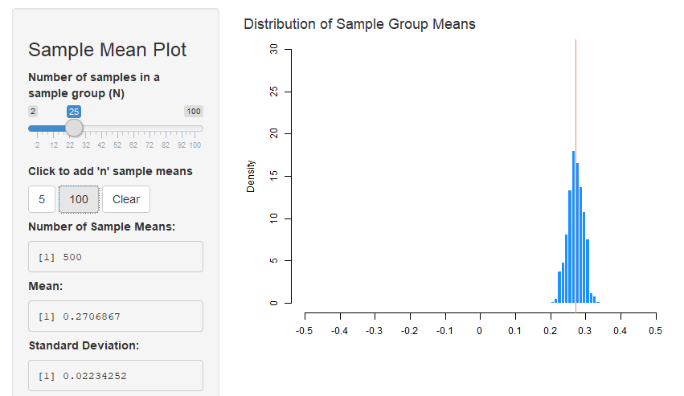
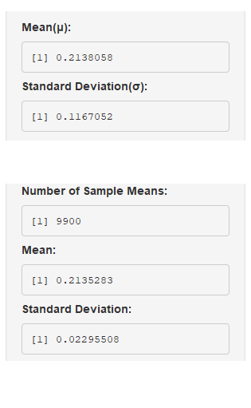

## Introduction

- [Central Limit Theorem](https://en.wikipedia.org/wiki/Central_limit_theorem) is a key concept in the frequentist probability theory: **Even if the original distribution is not normally distributed, the distribution of its sample means tends toward a normal distribution.** The idea itself is very simple, but it is somewhat hard to grasp for statistics learners only with written words and formulas. 

- My web-application, [Central Limit Theorem Visualisation](https://ethanjyk.shinyapps.io/cltvis/) shows how central limit theorem works by rendering how plots change as the number of sample means increases. And, it is **SUPER EASY**. 

  - Choose a distribution
  - Adjust shapes
  - Click buttons to add sample means
  - ... **PROFIT!!**

--- 

## How It Works

- Here is the overall layout of the app.

 

---

## How It Works: Main Plot

- You can see the **Main Plot** panel on the top left.

 <br></br>

&nbsp;&nbsp;&nbsp;&nbsp;- Choose a Distribution Type to create a pool of numbers.

&nbsp;&nbsp;&nbsp;&nbsp;- Move slider to adjust skewness.

&nbsp;&nbsp;&nbsp;&nbsp;- Below "Skewness" slider... 

&nbsp;&nbsp;&nbsp;&nbsp;- The panel shows the mean(mu) and standard deviation(sigma).


---

## How It Works: Main Plot

- **Main Plot** panel and the plot created using input values.




---

## How It Works: Sample Mean Plot

- You can also see the **Sample Mean Plot** panel on the bottom left.

 <br></br>

&nbsp;&nbsp;&nbsp;&nbsp;- Move slider to adjust the size of each sample(N) out of your pool.

&nbsp;&nbsp;&nbsp;&nbsp;- Click 5 / 100 Button to put additional sample means to the plot.

&nbsp;&nbsp;&nbsp;&nbsp;- Click more and see how the sample mean plot changes. 

&nbsp;&nbsp;&nbsp;&nbsp;- The plot approximates normal as the number increases.


---

## How It Works: Sample Mean Plot

- **Sample Mean Plot** panel and the plot created using input values.




---

## How It Works: Comparing Results

- Compare means and standard deviations of two plots.

 <br></br>

&nbsp;&nbsp;&nbsp;&nbsp;- With the number of sample means large enough(ex = 9900),

&nbsp;&nbsp;&nbsp;&nbsp;- the mean of your sample means becomes closer to the μ.

&nbsp;&nbsp;&nbsp;&nbsp;- and their standard deviation approximates sigma/sqrt(N), 

&nbsp;&nbsp;&nbsp;&nbsp;- 0.1167 / sqrt(25) = 0.02334 .... very close to 0.02295

&nbsp;&nbsp;&nbsp;&nbsp;- **The reality works just as the formula says!**

---

## An Example Process with R codes

```{r, echo=TRUE}
pool <- rbeta(10000, 10, 3) - 0.5 # create the original distribution
sample.mean <- vector()
N <- 25 # set the size of a sample group 
# sample 9900 times
for(i in 1:9900){sample.mean <- c(sample.mean, mean(sample(pool, N)))}
mean(pool); mean(sample.mean); sd(pool); sd(sample.mean) # Compare means and sds
```

---

## Links

- [Central Limit Theorem Visualisation](https://ethanjyk.shinyapps.io/cltvis/)

- You can also see the source codes on [my github repository](https://github.com/EthanJYK/datasciencecoursera/tree/master/9.%20Developing%20Data%20Products/CLTvis). 